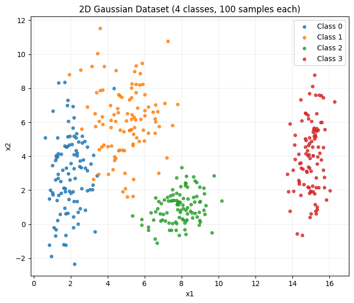
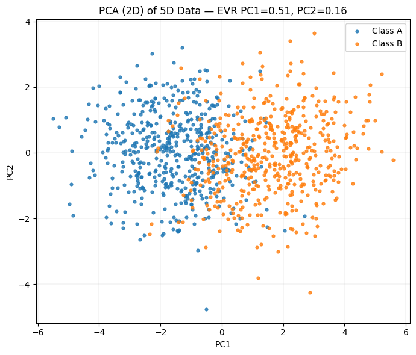
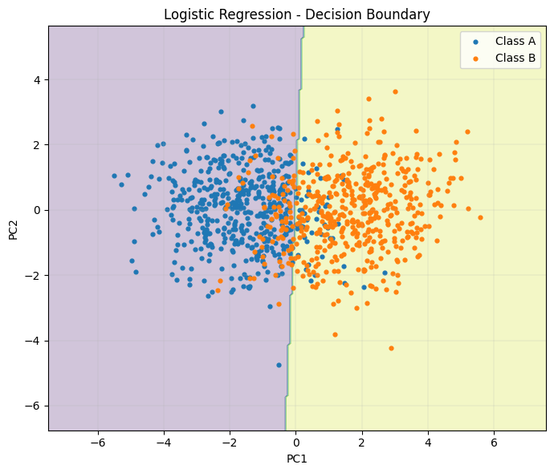
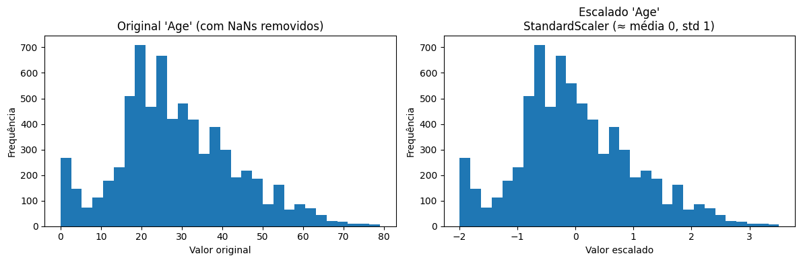
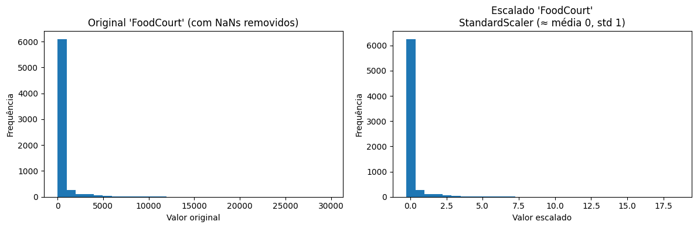

# Activity 01 — Data Preparation and Analysis for Neural Networks
## Exercise 1: Exploring Class Separability in 2D

### Objetivo
Explorar a separabilidade de classes em um dataset 2D e discutir implicações para o treinamento de um perceptron multicamadas (MLP).

### Sumário / Entrega
- Notebook de exploração: `code/exercises/01-Data/ex-01.ipynb`
- Relatório e gráficos (abaixo)
- Observações sobre expectativa de desempenho de um MLP e recomendações de treino

### Dataset e geração
O notebook gera quatro classes bidimensionais amostradas a partir de Gaussianas com médias e desvios (diagonais) distintos. Cada classe tem 100 amostras e utiliza sementes determinísticas para reprodutibilidade.

### Figuras
Figura 1: Pontos do dataset

Figura 2: Regiões de decisão (aproximação Gaussiana)

### Explicação
#### Distribuição/overlap

- Classe 0 (~x≈2, y≈3) é mais estreita em x e bem espalhada em y (desvio 2.5). Ela encosta na Classe 1 no eixo x.

- Classe 1 (~x≈5, y≈6) é mais alta (y grande) e também relativamente espalhada; há sobreposição moderada com a Classe 0 na faixa x≈3–4, sobretudo para y entre ~3 e ~6.

- Classe 2 (~x≈8, y≈1) é um blob mais compacto; fica bem separada em y da Classe 1 e um pouco distante em x da Classe 0.

- Classe 3 (~x≈15, y≈4) está bastante separada em x das demais; mesmo com variância grande em y, raramente invade as outras.

#### Linear separability?

- Um único hiperplano (reta) não separa as quatro classes ao mesmo tempo. Até dá para separar blocos (ex.: {0,1,2} vs {3}) com uma reta vertical, mas 0 vs 1 exigem cortes adicionais.

- Um classificador linear multiclasse (one‑vs‑rest ou softmax linear) produziria fronteiras lineares entre pares, mas aqui as covariâncias diferentes sugerem fronteiras curvas (melhor capturadas por um modelo não linear ou por um gerador Gaussiano/QDA).

#### Esboço das fronteiras

- Na Figura 2, apresenta o fundo com as regiões previstas por um classificador Gaussiano (usando as médias e desvios fornecidos, priors iguais).

- As fronteiras entre classes aparecem como curvas suaves (efeito das variâncias diferentes), algo parecido com o que uma rede neural com algumas camadas poderia aprender (ReLU + camadas suficientes aproximam bem essas superfícies).

## Exercise 2: Non-Linearity in Higher Dimensions

### Objetivo
Explorar a separabilidade não-linear em dados de dimensão superior (5D) e avaliar limitações de classificadores lineares versus modelos não lineares (MLP, QDA).

### Sumário / Entrega
- Notebook de exploração: `code/exercises/01-Data/ex-02.ipynb`
- Relatório e gráficos (abaixo)
- Observações sobre expectativa de desempenho de um MLP e recomendações de treino

### Dataset e geração
São geradas duas classes (A e B) com 500 amostras cada a partir de gaussianas multivariadas:

- μ_A = [0, 0, 0, 0, 0], μ_B = [1.5, 1.5, 1.5, 1.5, 1.5]
- Matrizes de covariância: `Sigma_A` e `Sigma_B` definidas explicitamente no notebook (incluem correlações internas diferentes entre dimensões)

As amostras são empilhadas, as features são centradas e padronizadas (z-score) antes de qualquer treino ou projeção.

### Figuras
Figura 1: projeção PCA (PC1 × PC2) mostrando classes A e B.

Figura 2: mapa de decisão da regressão logística (projeção e contorno de decisão).

### Explicação
#### O que o gráfico 1 mostra (relação entre as classes)

- As classes A (μ=0) e B (μ=1.5 em todas as dimensões) ficam deslocadas na projeção PCA, principalmente ao longo do PC1 (que concentra mais variância).

- Ainda assim, há uma faixa de sobreposição considerável entre os pontos — esperado, porque as distribuições são gaussianas com covariâncias diferentes (inclusive correlações opostas em A vs B em algumas dimensões).

#### Linear separability (por que é difícil)

- Em 5D, o fronteira ótima de Bayes para duas gaussianas com covariâncias diferentes é quadrática (QDA), não um hiperplano. Isso significa que:

    - Um modelo linear (Perceptron/Regressão Logística/Softmax linear) força uma única fronteira plana; ele tende a errar exatamente nas regiões onde as densidades se sobrepõem de forma curvada.

    - Já um modelo não linear (p.ex., MLP com ReLU/tanh) consegue aproximar superfícies curvas e capturar interações entre dimensões que emergem das correlações cruzadas (p.ex., correlação positiva em A e negativa em B entre x1–x2).

- Em termos práticos: um classificador linear pode até separar parcialmente a projeção (e talvez tenha boa acurácia média), mas não conseguirá modelar a fronteira curvada que minimiza o erro de Bayes.

## Exercise 3: Preparing Real-World Data for a Neural Network

### Objetivo
Demonstrar o pré-processamento completo de um dataset real, preparando as variáveis para alimentar uma rede neural com função de ativação `tanh`.  
O foco é lidar com **dados faltantes**, **variáveis categóricas** e **normalização** para garantir estabilidade no treinamento.

### Sumário / Entrega
- Notebook de exploração: `code/exercises/01-Data/ex-03.ipynb`
- Relatório com pipeline de preparação
- Gráficos mostrando impacto da transformação nas features numéricas
- Discussão sobre boas práticas de pré-processamento para MLPs

### Passos de Pré-processamento

1. **Engenharia inicial e limpeza**
   - Coluna `Cabin`: dividida em `Cabin_deck` e `Cabin_side` para capturar padrões adicionais.
   - Remoção de identificadores (`PassengerId`, `Name`) que não contribuem ao aprendizado.

2. **Definição de alvo e features**
   - Alvo: `Transported` (convertido de booleano para inteiro).
   - Features: todas as demais colunas relevantes (numéricas + categóricas).

3. **Tratamento de dados faltantes**
   - **Numéricas**: imputação pela **mediana**, robusta contra outliers e distribuições enviesadas.
   - **Categóricas**: imputação por valor constante `"Unknown"`, transformado em uma categoria válida.

4. **Codificação de categóricas**
   - `OneHotEncoder` aplicado a `HomePlanet`, `CryoSleep`, `Destination`, `VIP`, `Cabin_deck`, `Cabin_side`.
   - Uso de `handle_unknown="ignore"` para lidar com categorias novas em dados de teste.

5. **Normalização de numéricas**
   - Aplicado **StandardScaler** (média = 0, desvio padrão = 1).
   - Justificativa: `tanh` é centrada em zero e funciona melhor quando os inputs estão próximos de sua região linear (evitando saturação em ±1).

6. **Pipeline**
   - Implementado via `ColumnTransformer` e `Pipeline` do `scikit-learn`.

### Figuras
Foram gerados **histogramas comparando features antes e depois do scaling**:

`Figura 1 - Age`: distribuição relativamente normal, centrada próxima de 0 após o scaler, ideal para `tanh`.

`Figura 2 - FoodCourt`: altamente enviesada (muitos zeros, poucos outliers grandes). Após o scaler, a maioria fica próxima de 0, mas outliers permanecem muito distantes.

### Recomendações
**Para treino de MLP**:

  - Usar batch normalization ou camadas de dropout pode melhorar a robustez do modelo.
  - Features muito enviesadas (como gastos) devem ser transformadas (log/box-cox) para reduzir o impacto de outliers.
  - O pipeline atual já é suficiente para iniciar o treinamento estável de um MLP com `tanh`.