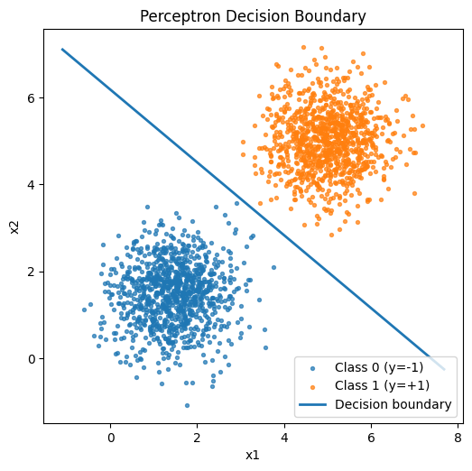

# Activity 02 - Perceptron
## Exercise 1: Classification with Clear Separation

### Descrição
- **Notebook de Exploração:** `code/exercises/02-Perceptron/ex-01.ipynb`
- **Classes:**  
    - Classe 0: média [1.5,1.5], variância 0.5  
    - Classe 1: média [5,5], variância 0.5  
- **Propriedades:** baixa variância e médias distantes → classes **perfeitamente separáveis**.  

### Resultados
- **Convergência:** não atingiu convergência estrita em 100 épocas, mas obteve 100% de acurácia.  
- **Acurácia final:** **100%**   

### Gráficos

**Dados e fronteira de decisão:**



**Acurácia por época:**


---

## Exercise 2 — Classification with Significant Overlap

### Descrição
- **Notebook de Exploração:** `code/exercises/02-Perceptron/ex-02.ipynb`
- **Classes:**  
    - Classe 0: média [3,3], variância 1.5  
    - Classe 1: média [4,4], variância 1.5  
- **Propriedades:** médias próximas + alta variância → **forte sobreposição** entre classes.  

### Resultados
- **Convergência:** nunca converge (updates persistem em todas as épocas).  
- **Acurácia final (melhor run):** ~**72.9%**  
- **Acurácia média (5 runs):** entre **60% e 73%**  
- **Erros:** ~700 pontos mal classificados em 2000.  

### Gráficos

**Dados e fronteira de decisão:**


**Acurácia por época:**


**Desempenho em múltiplas execuções (5 runs diferentes):**

---

## Comparação dos Exercícios

| Aspecto | Exercício 1 | Exercício 2 |
|---------|-------------|-------------|
| **Separabilidade** | Quase linearmente separável | Forte sobreposição |
| **Convergência** | Quase perfeita, acurácia ~100% | Nunca converge, oscila |
| **Acurácia final** | 100% | ~73% |
| **Erros** | 0 pontos | ~512 pontos |
| **Decisão** | Reta clara que separa bem | Reta com muitos erros inevitáveis |

### Visualização lado a lado

**Fronteiras de decisão:**

| Exercício 1 | Exercício 2 |
|-------------|-------------|
|  |  |

**Acurácia ao longo das épocas:**

| Exercício 1 | Exercício 2 |
|-------------|-------------|
|  |  |

---

## Exemplo de implementação do Perceptron:
```python
# Perceptron implementation
class Perceptron:
    def __init__(self, n_features, lr=0.01, max_epochs=100, seed=42):
        self.w = np.zeros(n_features)  
        self.b = 0.0                   
        self.lr = lr
        self.max_epochs = max_epochs
        self.rng = np.random.default_rng(seed)
        self.accuracy_history = []
        self.epochs_ran = 0
        self.converged = False

    def _activation(self, z):
        # Sign activation mapping to {-1, +1}. Note: treat 0 as +1 (common in perceptron).
        if z >= 0:
            return 1
        else:
            return -1

    def predict(self, X):
        # Vectorized prediction using sign on w·x + b
        z = X @ self.w + self.b
        return np.array([self._activation(val) for val in z])

    def fit(self, X, y):
        n = X.shape[0]
        indices = np.arange(n)

        for epoch in range(self.max_epochs):
            self.rng.shuffle(indices)
            updates = 0

            # Stochastic perceptron: loop over each sample
            for idx in indices:
                x_i = X[idx]
                y_i = y[idx]
                z = float(self.w @ x_i + self.b)
                y_pred = self._activation(z)
                if y_pred != y_i:
                    # Perceptron update rule
                    self.w = self.w + self.lr * y_i * x_i
                    self.b = self.b + self.lr * y_i
                    updates += 1

            # Track accuracy at end of epoch
            yhat = self.predict(X)
            acc = float((yhat == y).sum()) / float(n)
            self.accuracy_history.append(acc)

            # Check convergence: no updates in full pass
            if updates == 0:
                self.converged = True
                self.epochs_ran = epoch + 1
                break
        else:
            self.epochs_ran = self.max_epochs

        return self
```

## Conclusão
- O **Perceptron é eficiente** quando os dados são linearmente separáveis (Exercício 1).  
- Quando há **sobreposição entre classes** (Exercício 2), o Perceptron **não converge** e a acurácia fica limitada por essa sobreposição.  
- Isso mostra bem a **limitação do Perceptron linear**: ele só encontra fronteiras lineares e não consegue lidar com distribuições mais complexas. 