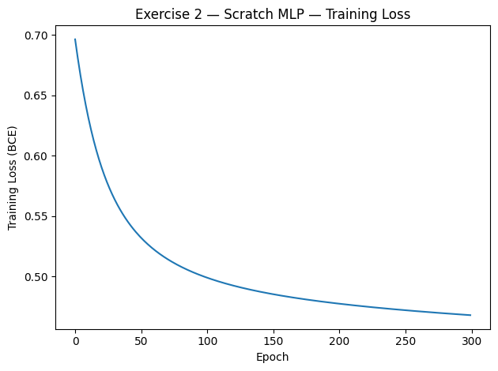

# Activity 03 - Multi-Layer Perceptron

## Exercise 1: Manual Calculation of MLP Steps

### Descrição
- **Notebook de Exploração:** `code/exercises/03-MLP/ex-01.ipynb`
- **Configuração:** entrada $\mathbf{x} = [0.5, -0.2]^\top$, MLP com uma camada oculta de 2 neurônios (tanh) e saída com tangente hiperbólica.
- **Objetivo:** percorrer manualmente forward, cálculo de perda (MSE), retropropagação e atualização com taxa de aprendizado $\eta = 0.1$.

### Resultados
- **Ativações ocultas:** $\mathbf{h}^{(1)} \approx [0.2636, -0.1781]$.
- **Saída prevista:** $\hat y = \tanh(0.3852) \approx 0.3672$ para alvo $y = 1$.
- **Perda (MSE):** $L = (y - \hat y)^2 \approx 0.4004$.
- **Gradientes principais:**
  - $\partial L / \partial \mathbf{W}^{(2)} \approx [-0.2886, 0.1950]$ e $\partial L / \partial b^{(2)} \approx -1.0948$.
  - $\partial L / \partial \mathbf{W}^{(1)} \approx \begin{bmatrix}-0.2547 & 0.1019\\0.1590 & -0.0636\end{bmatrix}$ e $\partial L / \partial \mathbf{b}^{(1)} \approx [-0.5094, 0.3180]$.
- **Atualização dos pesos:** após um passo de GD, $\mathbf{W}^{(2)} \rightarrow [0.5289, -0.3195]$ e $\mathbf{W}^{(1)}$ torna-se $\begin{bmatrix}0.3255 & -0.1102\\0.1841 & 0.4064\end{bmatrix}$, ilustrando como o gradiente ajusta cada parâmetro.

---

## Exercise 2 — Binary Classification with Scratch MLP

### Descrição
- **Notebook de Exploração:** `code/exercises/03-MLP/ex-02.ipynb`
- **Dados:** duas classes sintéticas em $\mathbb{R}^2$ (500 amostras cada). A classe 0 é gerada com um único cluster; a classe 1 combina dois clusters → fronteira não linear.
- **Pré-processamento:** embaralhamento com `RandomState(2025)` e `train_test_split` estratificado (80/20).
- **Modelo:** `ScratchMLP` com 1 camada oculta de 10 neurônios `tanh`, saída sigmoide, BCE e GD pleno por 300 épocas com $\eta = 0.05$.

### Resultados
- **Loss:** decresce de ~0.69 para ~0.47 ao longo de 300 épocas.
- **Acurácia de teste:** **73.5%**.
- **Matriz de confusão:** `[[100, 0], [53, 47]]` → a classe minoritária (label 1) concentra os erros (53 falsos negativos).

### Gráficos

**Curva de perda de treinamento:**

*Legenda:* Perda cai rapidamente no início e estabiliza próxima de 0.47, indicando que o aprendizado desacelera após ~150 épocas.

**Fronteira de decisão (probabilidades) vs. pontos de teste:**

*Legenda:* Regiões roxa e verde refletem probabilidades; classe 0 ocupa área inferior enquanto parte da classe 1 ocupa a área superior e parte invade a fronteira, explicando erros na região central.

**Matriz de confusão:**

*Legenda:* Classe 0 é sempre correta; 53 instâncias da classe 1 viram falso negativo, limitando a acurácia total.

---

## Exercise 3 — Multi-Class Classification (OvA MLP)

### Descrição
- **Notebook de Exploração:** `code/exercises/03-MLP/ex-03.ipynb`
- **Dados:** 3 classes sintéticas, 500 amostras por classe, 4 características. Cada classe usa número distinto de clusters (2, 3 e 4) para aumentar a sobreposição.
- **Pré-processamento:** embaralhamento (`RandomState(111)`), split estratificado 80/20.
- **Modelo:** abordagem One-vs-All com três instâncias do `ScratchMLP` (entrada 4→hidden 12→sigmoide), BCE e 200 épocas ($\eta = 0.05$) por classe.

### Resultados
- **Acurácia de teste:** **59.7%**.
- **Matriz de confusão:**
  - Classe 0: 51 corretos, confunde-se com classes 1 (19) e 2 (30).
  - Classe 1: 63 acertos (melhor desempenho), 25 → classe 0, 12 → classe 2.
  - Classe 2: 65 acertos, erros distribuídos (16 → classe 0, 19 → classe 1).
- **Perdas OvA:** todas convergem lentamente, mas mantêm valores acima de 0.47 → modelo limitado para separação perfeita.

### Gráficos

**Loss por classe (OvA):**

*Legenda:* Perdas das classes 0 e 2 permanecem mais altas que a da classe 1, evidenciando dificuldade adicional para esses classificadores OvA.

**Matriz de confusão (3 classes):**

*Legenda:* Diagonal dominante, mas confusões cruzadas entre classes 0 e 2 mostram limites do modelo raso.

**Projeção PCA(2D) colorida pela classe prevista:**

*Legenda:* Projeção PCA(2D) revela clusters sobrepostos, justificando a acurácia modesta do OvA.

---

## Exercise 4 — Multi-Class Classification with Deep MLP

### Descrição
- **Notebook de Exploração:** `code/exercises/03-MLP/ex-04.ipynb`
- **Dados:** mesmo cenário multiclasses do exercício 3, com nova semente (`RandomState(222)`), reforçando dificuldade moderada.
- **Modelo:** `ScratchDeepMLPSoftmax` com arquitetura 4→32→16→3, ativações `tanh`, softmax final, cross-entropy, regularização L2 ($10^{-4}$) e mini-batches de 64 exemplos.
- **Treinamento:** 180 épocas, $\eta = 0.05$; relatórios de loss a cada 45 épocas.

### Resultados
- **Loss:** cai de ~0.70 para **0.3597** até a época 180.
- **Acurácia de teste:** **81.7%** (ganho absoluto de +22 p.p. vs. OvA raso).
- **Matriz de confusão:**
  - Classe 0: 90 acertos, poucos erros (3→1, 7→2).
  - Classe 1: 84 acertos, 11 confundidos com classe 2.
  - Classe 2: 71 acertos, confusões residuais (14→0, 15→1).

### Gráficos

**Loss de treinamento (cross-entropy):**

*Legenda:* Perda cai continuamente até 0.36, confirmando melhor ajuste com rede mais profunda e regularizada.

**Matriz de confusão:**

*Legenda:* Predições concentram-se na diagonal, com poucas confusões residuais da classe 2 para as demais.

**Projeção PCA(2D) com classes previstas:**

*Legenda:* Classes previstas formam grupos mais distintos na projeção PCA, sinalizando separação superior.

---

## Comparação dos Exercícios

| Aspecto | Exercício 2 | Exercício 3 | Exercício 4 |
|---------|-------------|-------------|-------------|
| **Tarefa** | Binária (clusters assimétricos) | Multiclasse OvA | Multiclasse com softmax |
| **Arquitetura** | 2→10→1 (sigmoide) | 4→12→1 (3 modelos OvA) | 4→32→16→3 (softmax) |
| **Perda** | BCE | BCE (OvA) | Cross-Entropy + L2 |
| **Acurácia de teste** | 73.5% | 59.7% | 81.7% |
| **Pontos críticos** | Classe 1 pouco representada | OvA não captura interações entre classes | Modelo mais profundo melhora separação |

### Visualização lado a lado

**Curvas de perda**

| Exercício 2 | Exercício 3 | Exercício 4 |
|-------------|-------------|-------------|
|  |  |  |

*Legenda:* As curvas destacam que o modelo do Ex4 converge para perdas significativamente menores, enquanto o OvA (Ex3) permanece acima do MLP binário em loss médio.

**Matrizes de confusão**

| Exercício 2 | Exercício 3 | Exercício 4 |
|-------------|-------------|-------------|
|  |  |  |

*Legenda:* Comparação direta mostra melhoria progressiva: o Ex2 sofre com falsos negativos, o Ex3 distribui erros entre classes e o Ex4 concentra acertos na diagonal.

## Conclusões
- O exercício manual mostra como cada gradiente contribui para ajustes finos nos parâmetros do MLP.
- Em cenários binários com fronteira não linear, um MLP simples já melhora a separação, mas pode sofrer em regiões com forte sobreposição.
- Para múltiplas classes, treinar classificadores OvA independentes mantém limitações de expressividade; ampliar profundidade e usar softmax conjunto eleva substancialmente o desempenho.
