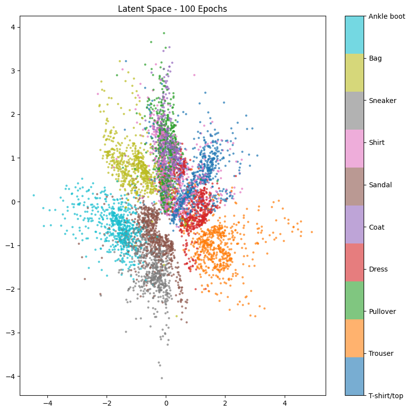

# Activity 04 - Variational Autoencoder

## Exercise — Fashion-MNIST VAE

### Descrição
- **Notebook de exploração:** `code/exercises/04-VAE/ex-01.ipynb`
- **Colab**: Os resultados apresentados foram obtidos executando o notebook no Google Colab, garantindo acesso a recursos computacionais adequados para treinamento eficiente do modelo, utilizando a GPU T4.
- **Dados:** Fashion-MNIST (60.000 treino, 10.000 teste) com split adicional treino/validação (90%/10%) gerado via `random_split` para monitoramento durante o treinamento.
- **Pré-processamento:** transformação direta para tensors via `transforms.ToTensor()`, normalizando pixels para [0,1].
- **Arquitetura:** 
    - **Encoder:** três blocos convolucionais (1→32→64→128 canais) com stride 2 e ReLU, reduzindo imagens de $28\times28$ para feature maps $4\times4$; projeções lineares independentes geram $\mu$ e $\log\sigma^2$ no espaço latente.
    - **Decoder:** camada linear expande latente para $128\times4\times4$, seguida de três blocos `ConvTranspose2d` (128→64→32→16) e convolução final para reconstruir imagens $28\times28$.
- **Hiperparâmetros padrão:** `batch_size=128`, `epochs=10`, `lr=2e-3`, `latent_dim=2`, `beta=1.0` (peso do termo KL), otimizador Adam, `seed=42`.
- **Objetivo:** otimizar a ELBO (Evidence Lower Bound) combinando reconstrução BCE (Binary Cross-Entropy) e regularização KL-divergence ponderada por $\beta$, inspecionando qualidade de reconstruções e estrutura do espaço latente.

### Resultados Principais

#### Métricas de Treinamento
Após 10 épocas de treinamento, o modelo converge com as seguintes perdas médias por amostra:
- **ELBO total:** valor final reflete o equilíbrio entre reconstrução e regularização
- **Reconstrução (BCE):** quantifica a fidelidade pixel-a-pixel entre imagem original e reconstruída
- **KL-Divergence:** mede o quanto a distribuição latente $q(z|x)$ se afasta da prior gaussiana $\mathcal{N}(0, I)$

#### Qualidade das Reconstruções
- Após 10 épocas, o VAE já reconstrói a **estrutura global** de cada categoria (blusas, calçados, bolsas), capturando formas e proporções gerais.
- Detalhes finos como bordas, texturas e padrões ainda apresentam **borrões característicos** devido à regularização KL que mantém o espaço latente suave e contínuo.
- Com 50 épocas, contornos ficam mais nítidos e elementos como saltos, alças e costuras começam a emergir com maior contraste.
- Aos 100 épocas, o modelo atinge estabilidade com reconstruções detalhadas, embora pequenas perdas de informação sejam inevitáveis devido à compressão para 2 dimensões.

#### Estrutura do Espaço Latente
- O espaço latente 2D revela **separação semântica natural** entre categorias:
  - **Calçados** (Sneaker, Ankle boot, Sandal) concentram-se em regiões específicas (cyan/cinza), formando clusters densos.
  - **Roupas superiores** (T-shirt/top, Shirt, Pullover) ocupam outra região (vermelho/verde), com maior sobreposição devido à similaridade visual.
  - **Categorias ambíguas** como Dress e Coat transitam entre regiões, refletindo características compartilhadas.
- A progressão de 10→50→100 épocas **refina a separação angular** entre clusters, reduzindo sobreposição e criando fronteiras mais definidas.

#### Geração de Amostras
- Amostras geradas por **sampling aleatório** do espaço latente ($z \sim \mathcal{N}(0, I)$) exibem:
  - **Diversidade visual:** diferentes categorias de itens aparecem naturalmente.
  - **Transições suaves:** interpolação entre pontos do latente gera transformações graduais (e.g., sneaker → ankle boot).
  - **Coerência estrutural:** mesmo amostras de regiões intermediárias mantêm formas plausíveis, confirmando que o decoder aprendeu um mapeamento contínuo $z \rightarrow x$.

### Reconstruções e Geração

#### Comparação Visual de Reconstruções

| Original | VAE 10 Épocas | VAE 50 Épocas | VAE 100 Épocas | VAE 10 Épocas · Latent 50 |
|----------|---------------|---------------|----------------|---------------------------|
|  |  |  |  |  |

**Análise comparativa**

- **Original (coluna 1):** imagens nítidas do Fashion-MNIST com bordas bem definidas e detalhes preservados.
- **VAE 10 Épocas (coluna 2):** reconstruções capturam forma geral e posicionamento dos itens, mas apresentam suavização excessiva. Bordas ficam difusas devido à regularização KL que força distribuições latentes próximas à prior gaussiana.
- **VAE 50 Épocas (coluna 3):** melhoria significativa nos contornos; detalhes como saltos de sapatos e alças de bolsas tornam-se visíveis. O termo KL estabiliza permitindo que a reconstrução memorize padrões mais finos.
- **VAE 100 Épocas (coluna 4):** convergência visual com detalhes máximos para `latent_dim=2`. Pequenas texturas e costuras aparecem, embora ainda ligeiramente borradas devido à limitação dimensional.
- **VAE 10 Épocas · Latent 50 (coluna 5):** com 50 dimensões latentes, mesmo após apenas 10 épocas as reconstruções já exibem **texturas mais suaves e menos artifacts**. O espaço latente expandido permite codificar mais informação sem violar excessivamente a prior, acelerando a convergência visual.

**Observação técnica:** a progressão 10→50→100 épocas demonstra que o termo KL não impede o modelo de memorizar padrões finos ao longo do treino — ele apenas retarda o processo inicial de ajuste, garantindo que o espaço latente permaneça regularizado e útil para geração.

#### Amostras Geradas por Sampling Aleatório

**Análise das amostras geradas:**

- **Diversidade de categorias:** a grade contém sneakers, ankle boots, t-shirts, pullovers, dresses e bags, confirmando que o decoder aprendeu a mapear diferentes regiões do espaço latente $\mathcal{N}(0, I)$ para categorias distintas.
- **Transições suaves:** amostras adjacentes frequentemente mostram variações graduais (e.g., orientação de sapatos, comprimento de mangas), evidenciando a continuidade do espaço latente.
- **Coerência estrutural:** mesmo em regiões intermediárias entre clusters de classes, as amostras mantêm formas plausíveis, sem artifacts severos ou colapso para ruído.
- **Limitações:** algumas amostras exibem características híbridas (e.g., item entre bolsa e sapato), reflexo da sobreposição de distribuições latentes entre categorias similares.

**Implicação prática:** a capacidade de gerar amostras coerentes via sampling aleatório é essencial para aplicações de síntese de dados, interpolação controlável e exploração criativa do espaço de design.

### Espaço Latente

#### Visualização Comparativa do Espaço Latente

| VAE 10 Épocas | VAE 50 Épocas | VAE 100 Épocas | VAE 10 Épocas · Latent 50 (PCA) |
|---------------|---------------|----------------|---------------------------------|
|  |  |  |  |

#### Análise da Evolução do Espaço Latente

**VAE 10 Épocas (`latent_dim=2`):**

- **Separação inicial:** pontos de calçados (Ankle boot, Sneaker, Sandal — cores cyan/cinza) já formam agrupamentos distintos em uma região do espaço latente.
- **Sobreposição de roupas:** categorias de vestuário superior (T-shirt, Shirt, Pullover — cores vermelho/verde/amarelo) apresentam forte sobreposição devido à similaridade visual (mangas, golas, comprimento).
- **Categorias ambíguas:** Dress, Coat e Bag transitam entre regiões, refletindo características híbridas (e.g., Bag compartilha forma retangular com Coat).
- **Distribuição global:** clusters ainda mostram dispersão significativa, com fronteiras pouco definidas.

**VAE 50 Épocas (`latent_dim=2`):**

- **Refinamento angular:** a separação entre calçados e roupas torna-se mais angular, com clusters movendo-se para extremos opostos do espaço latente.
- **Redução de sobreposição:** pontos de categorias distintas começam a formar clusters mais densos, reduzindo invasão mútua de regiões.
- **Estrutura emergente:** eixos latentes adquirem significado semântico implícito — um eixo parece correlacionar com "rigidez/forma" (calçados vs. roupas), outro com "comprimento/cobertura".

**VAE 100 Épocas (`latent_dim=2`):**

- **Clusters bem definidos:** calçados formam grupo coeso com fronteiras claras; roupas superiores separam-se melhor entre si.
- **Minimização de sobreposição:** categorias intermediárias (Dress, Coat) encontram posições estáveis entre clusters principais.
- **Estabilidade:** a distribuição converge para configuração estável, com ganhos marginais após este ponto.
- **Limitação dimensional:** mesmo com treino extenso, `latent_dim=2` força sobreposição residual entre T-shirt/Shirt devido à insuficiência dimensional para codificar diferenças sutis.

**VAE 10 Épocas · Latent 50 (Projeção PCA para 2D):**

- **Clusters difusos:** ao projetar 50 dimensões para 2D via PCA, os clusters parecem mais espalhados e sobrepostos que no `latent_dim=2` nativo.
- **Interpretação:** a projeção PCA captura apenas parte da variância total — no espaço latente original de 50D, as classes provavelmente ocupam regiões bem separadas ao longo de múltiplas direções ortogonais.
- **Vantagem dimensional:** com mais dimensões, o modelo distribui cada categoria em subespaços distintos sem forçar compressão excessiva, permitindo reconstruções mais fiéis mesmo com menos épocas.
- **Diagnóstico:** a aparente "desorganização" na PCA não indica falha do modelo, mas sim que a estrutura latente é genuinamente multidimensional e não pode ser resumida adequadamente em 2D.

#### Interpretação Semântica

**Separação de categorias:**

- **Calçados vs. Roupas:** separação mais robusta, refletindo diferença fundamental de forma (item rígido delimitado vs. tecido drapeado).
- **Intra-categoria:** dentro de roupas, T-shirt e Pullover separam-se moderadamente (manga curta vs. longa), enquanto Shirt permanece sobreposto com ambos.
- **Transições suaves:** ao interpolar entre pontos de clusters distintos (e.g., Sneaker → T-shirt), o decoder gera transformações graduais passando por formas intermediárias.

**Impacto da dimensionalidade latente:**

- **`latent_dim=2`:** interpretabilidade visual máxima, mas capacidade expressiva limitada — categorias similares são forçadas a compartilhar regiões.
- **`latent_dim=50`:** maior capacidade de codificar nuances, permitindo separação completa, mas projeções 2D (PCA) perdem informação estrutural crítica.
- **Trade-off:** escolher dimensão latente equilibra interpretabilidade humana (≤3D) vs. fidelidade de reconstrução/geração (>10D).

### Experimentos e Variações

#### Impacto do Número de Épocas

**Convergência visual (10 vs. 50 vs. 100 épocas):**

- **10 épocas:** modelo aprende estruturas básicas rapidamente; reconstruções capturam forma mas perdem detalhes finos.
- **50 épocas:** melhoria substancial em nitidez; bordas e texturas emergem com contraste significativo.
- **100 épocas:** ganhos marginais após 50 épocas; modelo atinge limite de capacidade expressiva para `latent_dim=2`.
- **Diagnóstico de custo-benefício:** para `latent_dim=2`, 50 épocas oferecem melhor relação qualidade/tempo; 100+ épocas úteis apenas para latentes maiores ou ajuste fino.

**Evolução do espaço latente:**

- Com mais épocas, clusters **não apenas se separam** (aumento de distância inter-cluster), mas também **se densificam** internamente (redução de variância intra-cluster).
- O termo KL mantém distribuições próximas à prior, evitando "buracos" no espaço latente — sampling aleatório permanece viável mesmo com clusters bem definidos.

#### Impacto da Dimensão Latente

**`latent_dim=2` (visualização nativa 2D):**

- Interpretabilidade direta via scatter plot sem projeções.
- Transições suaves entre categorias facilmente observáveis.
- Sobreposição forçada entre categorias similares (T-shirt/Shirt).
- Reconstruções com borrão persistente mesmo após muitas épocas.

**`latent_dim=50` (alta capacidade expressiva):**

- Reconstruções mais nítidas já nas primeiras épocas.
- Separação completa de categorias em múltiplas dimensões ortogonais.
- Capacidade de codificar variações intra-categoria (e.g., orientação de sapatos).
- Visualização requer PCA/t-SNE, perdendo estrutura original.
- Projeções 2D mostram clusters difusos, dificultando análise visual direta.
- Risco de overfitting se conjunto de treino for pequeno (mitigado pela regularização KL).

**Recomendação prática:**

- **Exploração/ensino:** `latent_dim=2-3` para visualização direta da estrutura latente.
- **Aplicações de geração:** `latent_dim=10-50` para qualidade visual maximizada.
- **Datasets complexos:** aumentar dimensão proporcionalmente à diversidade dos dados (CIFAR-10 pode necessitar 128+, CelebA 256+).

### Lições da Atividade

#### Fundamentos Teóricos Validados

1. **ELBO como objetivo de otimização:**
    - A decomposição ELBO = Reconstrução + KL-Divergence equilibra fidelidade visual (termo de reconstrução) com regularização (termo KL).
    - Com $\beta=1$ (configuração padrão), o modelo aprende representações úteis sem colapsar para autoencoder determinístico nem ignorar dados em favor da prior.

2. **Reparametrização e backpropagation:**
    - O truque de reparametrização ($z = \mu + \sigma \odot \epsilon$, onde $\epsilon \sim \mathcal{N}(0,I)$) permite gradientes fluírem através do sampling estocástico.
    - Sem isso, o termo KL forçaria $\sigma \rightarrow 0$, colapsando para autoencoder determinístico sem capacidade generativa.

3. **Espaço latente contínuo:**
    - A regularização KL garante que **regiões intermediárias** entre clusters de treino mapeiam para amostras coerentes, não para ruído.
    - Propriedade essencial para interpolação controlável e exploração criativa do espaço de design.

#### Insights Práticos

1. **Mais épocas refinam gradualmente:**
    - Ganhos substanciais até ~50 épocas para `latent_dim=2`.
    - Após convergência da perda, melhorias visuais tornam-se marginais — útil monitorar reconstruções qualitativas além de métricas quantitativas.

2. **Dimensão latente é hiperparâmetro crítico:**
    - Escolha impacta trade-off interpretabilidade vs. capacidade expressiva.
    - Projeções PCA/t-SNE de latentes >3D ajudam diagnosticar separação de clusters, mas não substituem inspeção de reconstruções/amostras.

3. **Separação semântica emerge naturalmente:**
    - Mesmo sem labels durante treino (VAE é não-supervisionado), categorias visuais distintas formam clusters — modelo captura estrutura intrínseca dos dados.
    - Categorias similares (T-shirt/Shirt) sobrepõem-se, refletindo ambiguidade genuína nos dados.

4. **Geração via sampling é viável:**
    - Amostras aleatórias $z \sim \mathcal{N}(0,I)$ produzem itens coerentes, validando que o decoder aprendeu mapeamento robusto $z \rightarrow x$.
    - Para controle fino (e.g., gerar especificamente sneakers), explorar condicionamento (Conditional VAE) ou clustering do espaço latente.

#### Direções Futuras

**Extensões arquiteturais:**

- **$\beta$-VAE:** variar $\beta > 1$ para forçar maior disentanglement de fatores latentes (e.g., orientação independente de categoria).
- **Hierarchical VAE:** múltiplos níveis latentes para capturar abstrações em escalas diferentes.
- **VQ-VAE:** quantizar espaço latente para melhorar nitidez de reconstruções.

**Aplicações práticas:**

- **Data augmentation:** gerar amostras sintéticas para balancear classes desbalanceadas.
- **Detecção de anomalias:** itens com alta perda de reconstrução podem indicar amostras fora da distribuição de treino.
- **Compressão:** usar $\mu$ como representação compacta para armazenamento/transmissão (perda controlada por `latent_dim`).

**Melhorias de treinamento:**

- **Annealing de $\beta$:** começar com $\beta \approx 0$ e aumentar gradualmente para estabilizar treinamento inicial.
- **Free bits:** permitir termo KL mínimo por dimensão latente para evitar colapso de dimensões não usadas.
- **Schedulers de learning rate:** reduzir lr após convergência para refinamento fino.
