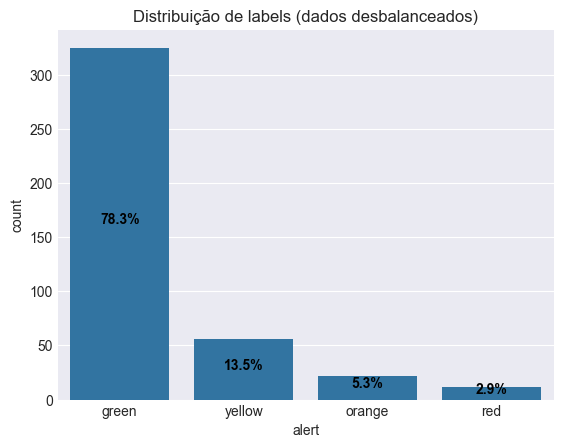
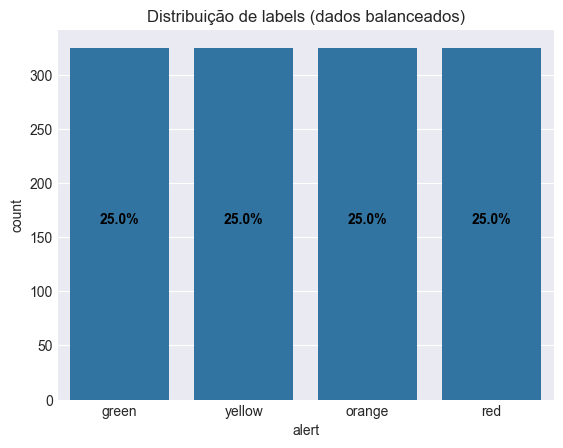
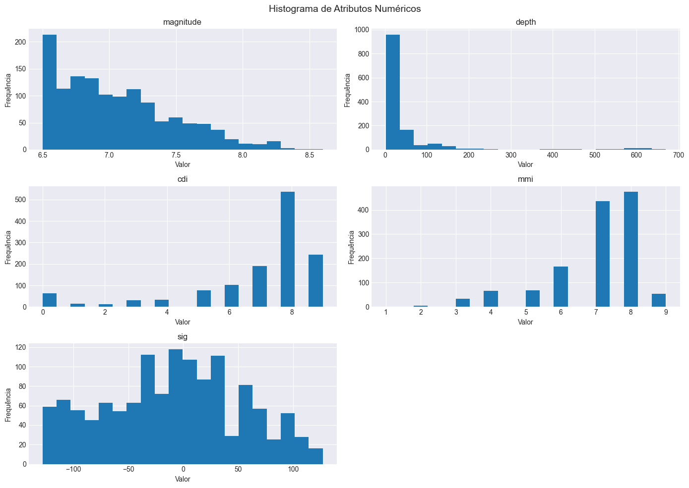
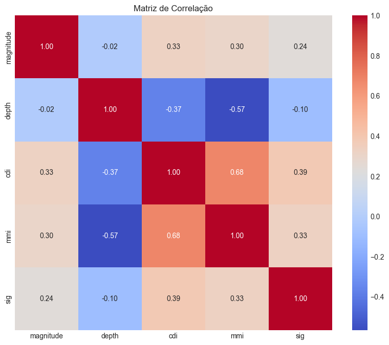
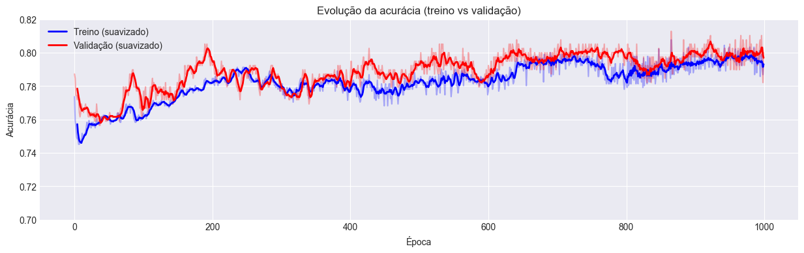
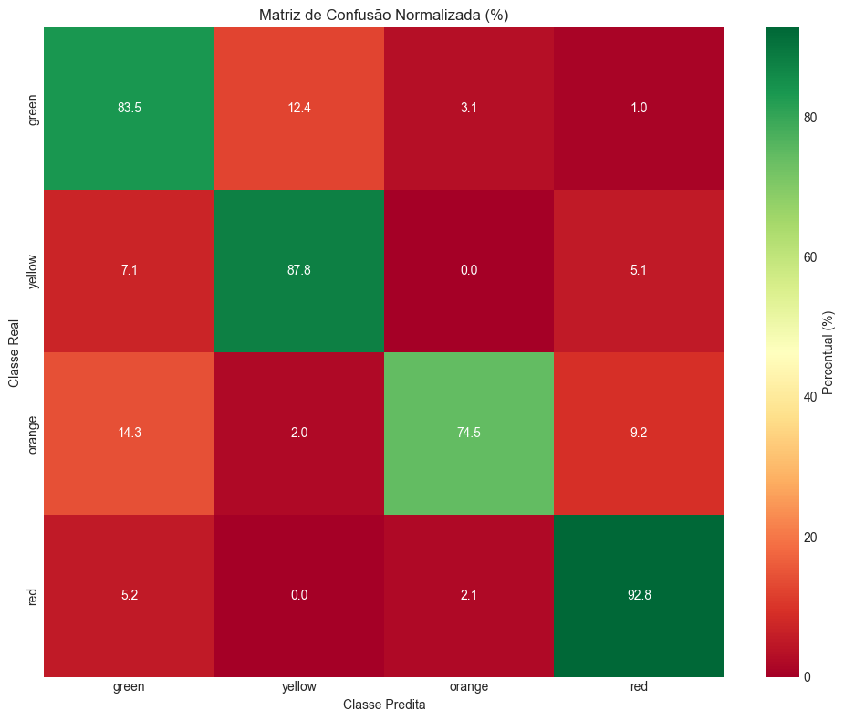
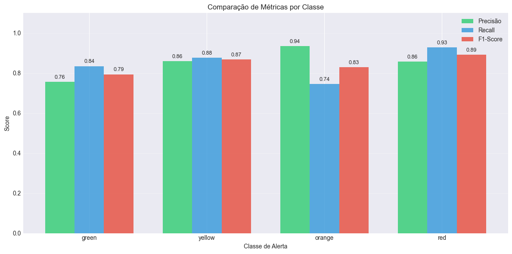
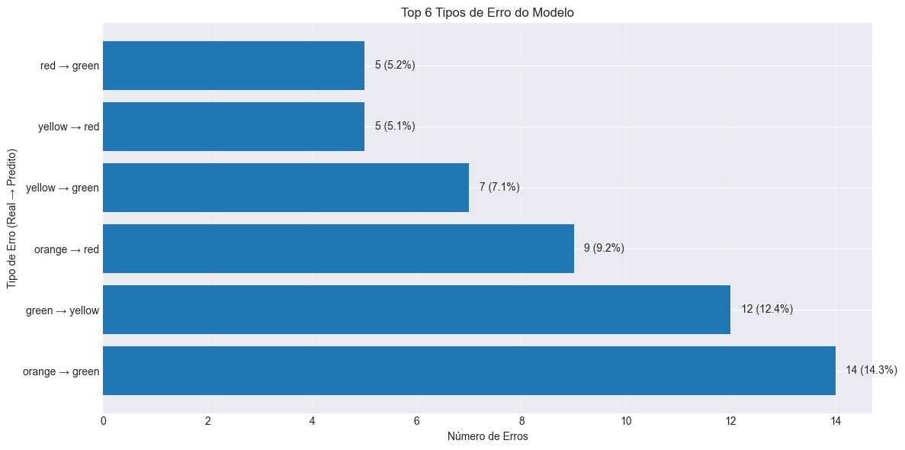
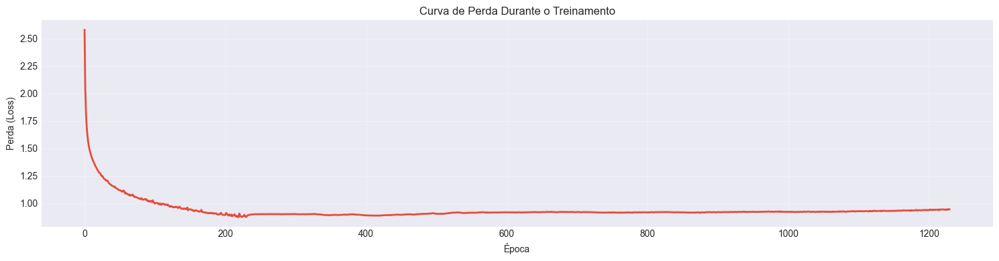
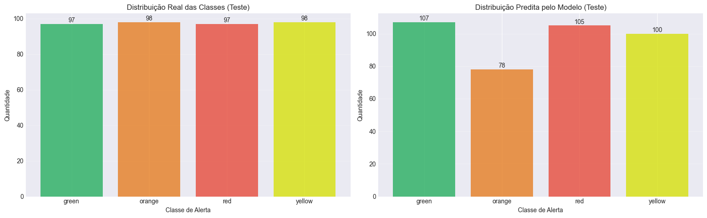

# Projeto 01 — Classificação de Alertas de Terremotos com MLP

## Estudantes
- Pedro De Lucca S C Ferro
- Carlos Yamada

## Código Fonte
- Notebook de exploração e modelagem: `code/projects/01-Classification/main.ipynb`

## Resumo

Este projeto implementa uma rede neural Multi-Layer Perceptron (MLP) para classificação de alertas de terremotos em quatro categorias: **green**, **yellow**, **orange** e **red**. O modelo foi treinado utilizando dados sísmicos que incluem características como magnitude, profundidade, intensidade sentida pela comunidade (CDI), intensidade de danos (MMI) e significância do evento.

## Fontes de Dados

Os datasets utilizados neste projeto estão disponíveis no Kaggle:

- **Earthquake Dataset**: [https://www.kaggle.com/datasets/warcoder/earthquake-dataset](https://www.kaggle.com/datasets/warcoder/earthquake-dataset)
- **Earthquake Alert Prediction Dataset**: [https://www.kaggle.com/datasets/ahmeduzaki/earthquake-alert-prediction-dataset](https://www.kaggle.com/datasets/ahmeduzaki/earthquake-alert-prediction-dataset)

## Objetivos

- Desenvolver um modelo de classificação multiclasse para prever o nível de alerta de terremotos
- Avaliar o desempenho do modelo utilizando múltiplas métricas (acurácia, precisão, recall, F1-score)
- Analisar os padrões de erro e limitações do modelo
- Comparar o desempenho em dados balanceados vs desbalanceados

## Dataset

### Descrição dos Dados

O dataset utilizado é uma versão pré-processada e otimizada especificamente para aplicações de machine learning em avaliação de riscos sísmicos e sistemas de predição de alertas de terremotos. Contém **1.300 amostras** e **6 colunas**, representando registros de eventos sísmicos com diferentes intensidades e alertas associados.

| Coluna      | Tipo                | Descrição                                                                                 |
| ----------- | ------------------- | ----------------------------------------------------------------------------------------- |
| `magnitude` | Numérica (float)    | Medida da energia liberada pelo terremoto na escala Richter                              |
| `depth`     | Numérica (float)    | Profundidade do epicentro em quilômetros                                                 |
| `cdi`       | Numérica (float)    | *Community Determined Intensity* – intensidade sentida pela população (escala de 1 a 10) |
| `mmi`       | Numérica (float)    | *Modified Mercalli Intensity* – intensidade dos danos observados (escala de 1 a 12)     |
| `sig`       | Numérica (float)    | Significância do evento (pontuação calculada pelo USGS)                                  |
| `alert`     | Categórica (string) | Variável alvo: nível de alerta — **green**, **yellow**, **orange**, ou **red**           |

### Balanceamento dos Dados via SMOTE

O dataset utilizado foi balanceado utilizando **SMOTE** (*Synthetic Minority Over-sampling Technique*), uma técnica avançada de oversampling que gera amostras sintéticas para as classes minoritárias. Diferente da simples duplicação de amostras, o SMOTE cria novos exemplos interpolando entre instâncias existentes da classe minoritária, resultando em:

- **Melhor generalização**: O modelo aprende padrões mais diversos em vez de memorizar amostras duplicadas
- **Redução de overfitting**: Amostras sintéticas adicionam variabilidade controlada ao dataset
- **Distribuição equilibrada**: Todas as classes de alerta possuem aproximadamente o mesmo número de amostras

*Figura 1: Distribuição das classes no conjunto de dados desbalanceado*

*Figura 2: Distribuição das classes no conjunto de dados balanceado (utilizado no treinamento)*

### Análise Exploratória

*Figura 3: Distribuição dos atributos numéricos do dataset*

*Figura 4: Matriz de correlação entre as variáveis numéricas*

As principais observações da análise exploratória incluem:
- Forte correlação entre `magnitude` e `sig` (significância)
- Correlação moderada entre `cdi` e `mmi`
- `depth` apresenta menor correlação com outras variáveis

## Metodologia

### Pré-processamento

1. **One-hot Encoding**: Conversão da variável categórica `alert` em 4 colunas binárias
2. **Normalização Z-Score**: Padronização de todas as features numéricas usando média e desvio padrão
3. **Embaralhamento**: Randomização das amostras para evitar overfitting por enviesamento
4. **Divisão dos dados**: 70% treino, 30% teste (com `random_state=42`)

### Arquitetura do Modelo

**Multi-Layer Perceptron (MLP) - Scikit-learn**

- **Camada de entrada**: 5 neurônios (features normalizadas)
- **Camada oculta**: 16 neurônios
- **Camada de saída**: 4 neurônios (classes de alerta)
- **Função de ativação**: ReLU (camadas ocultas), Softmax (saída)
- **Otimizador**: Adam
- **Learning rate**: 0.01
- **Batch size**: 100
- **Épocas**: 1000

## Resultados

### Evolução do Treinamento

*Figura 5: Evolução da acurácia ao longo das 1000 épocas de treinamento*

*Figura 6: Matriz de confusão dos resultados de teste*

*Figura 7: Comparação de Precisão, Recall e F1-Score por classe de alerta*

### Métricas de Performance

| Métrica | Conjunto de Treino | Conjunto de Teste |
|---------|-------------------|-------------------|
| **Acurácia** | ~80% | ~78% |
| **Diferença (Overfitting)** | - | ~2% |

O modelo apresentou boa generalização, com diferença mínima entre treino e teste, indicando ausência de overfitting significativo.

### Erros mais significativos

*Figura 8: Visualização dos principais erros*

### Curva de perda durante o treinamento

*Figura 9: Curva de perda durante o treinamento*

### Comparação entre as distribuições de reais e preditas

*Figura 10: Comparação entre as distribuições de reais e preditas*

### Análise de Erros

Os principais tipos de erro do modelo incluem:
- Confusão entre classes adjacentes (`orange` ↔ `green`, `green` ↔ `yellow`)
- Melhor desempenho nas classes extremas (`yellow` e `red`)
- Maior dificuldade nas classes intermediárias devido à sobreposição de características

### Distribuição das Predições

A distribuição das predições do modelo manteve-se consistente com a distribuição real das classes no conjunto de teste, indicando que o modelo não apresenta viés significativo em direção a nenhuma classe específica.

## Discussão

### Pontos Fortes

1. **Boa generalização**: Diferença mínima entre acurácia de treino e teste (~2%)
2. **Modelo balanceado**: Não apresenta viés excessivo para nenhuma classe
3. **Convergência estável**: Curva de perda monotonicamente decrescente
4. **Performance consistente**: Métricas equilibradas entre precisão e recall

### Limitações

1. **Confusão entre classes adjacentes**: O modelo tem dificuldade em distinguir alertas de níveis próximos
2. **Acurácia moderada**: ~78% pode não ser suficiente para aplicações críticas de segurança
3. **Arquitetura simples**: Uma única camada oculta pode limitar a capacidade de aprender padrões complexos

### Melhorias Possíveis

- Adicionar mais camadas ocultas para aumentar a capacidade representacional
- Implementar técnicas de regularização (Dropout, L2)
- Explorar outras arquiteturas (CNN, LSTM) se houver dados temporais
- Aumentar o dataset para melhorar a generalização
- Feature engineering: criar variáveis derivadas das existentes
- Ajuste fino de hiperparâmetros via Grid Search ou Random Search

## Conclusão

O modelo MLP desenvolvido demonstrou capacidade satisfatória para classificação de alertas de terremotos, atingindo ~78% de acurácia no conjunto de teste. A análise detalhada revelou que o modelo funciona melhor para classes extremas (green e red) e apresenta maior confusão entre classes adjacentes. 

Para aplicações em sistemas de alerta real, recomenda-se:
- Priorizar recall para classes críticas (red e orange) para minimizar falsos negativos
- Investigar técnicas de ensemble para melhorar a robustez
- Coletar mais dados para as transições entre classes
